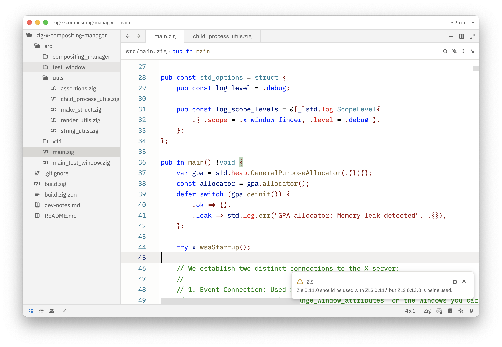
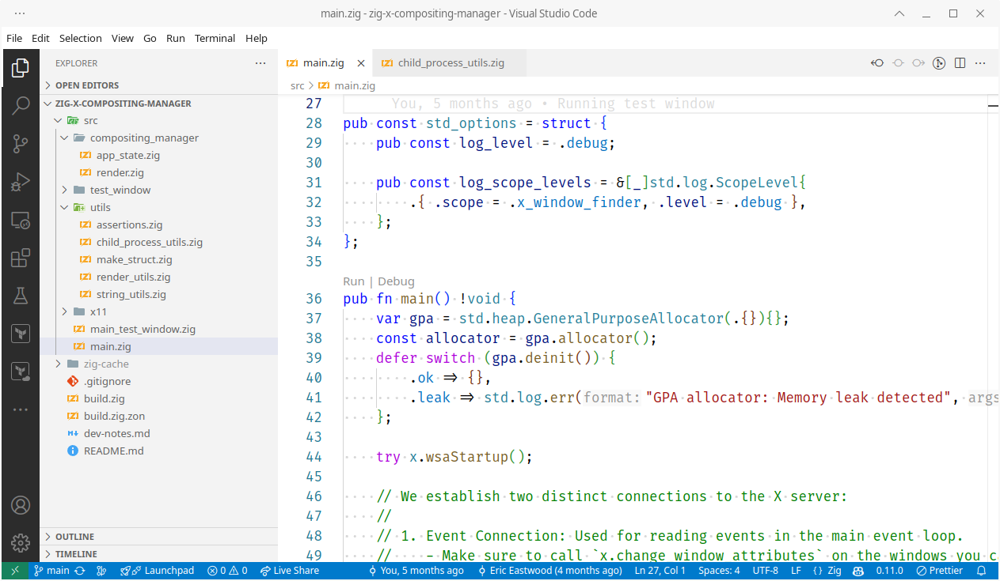
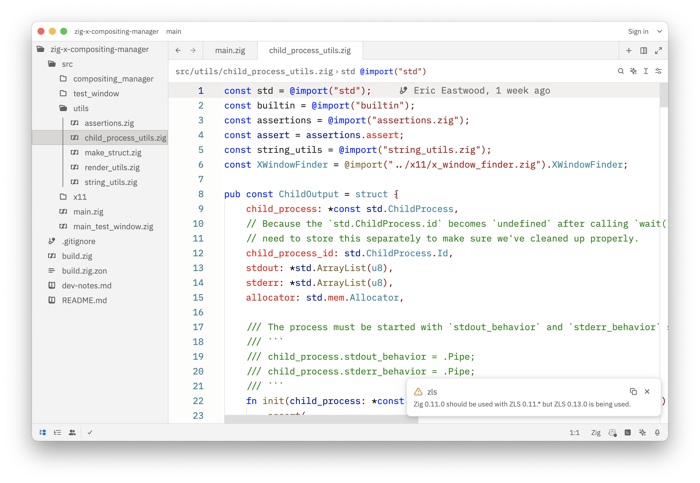
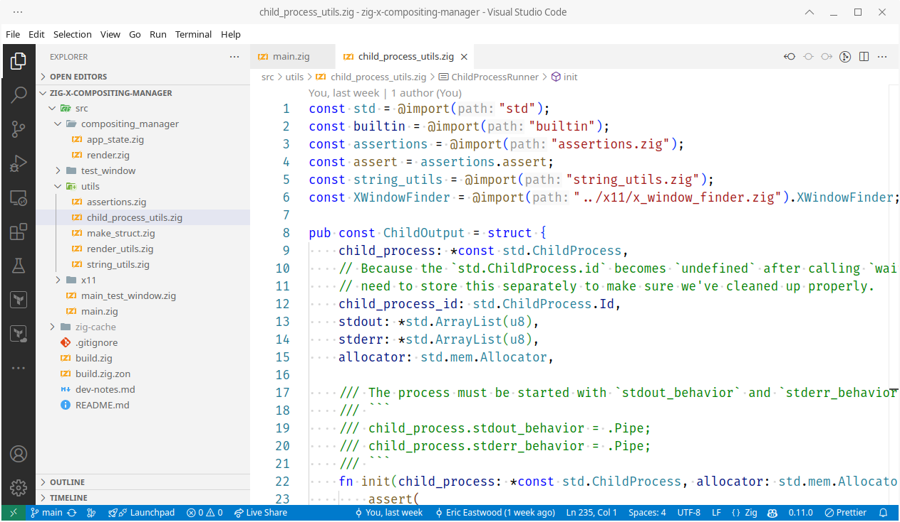
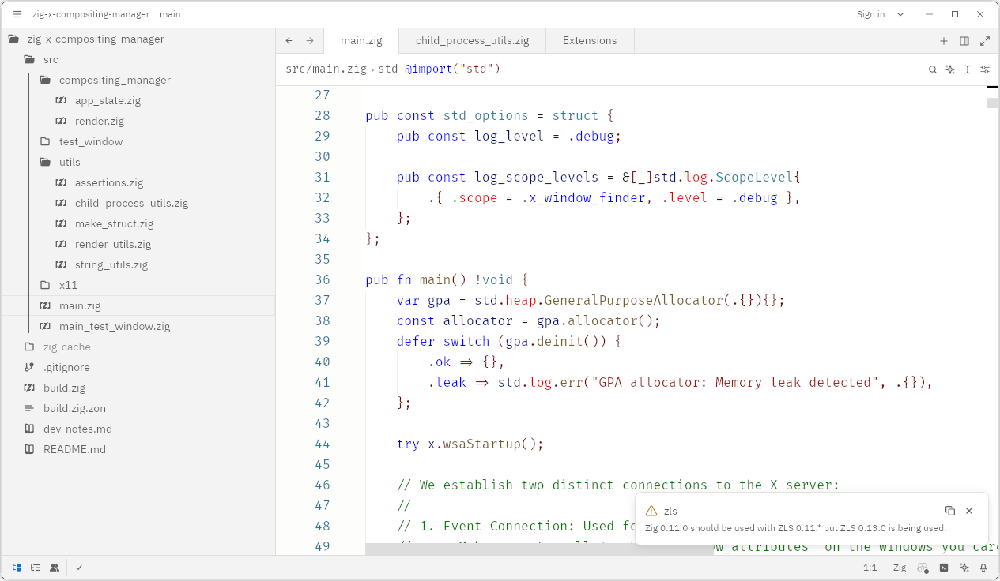
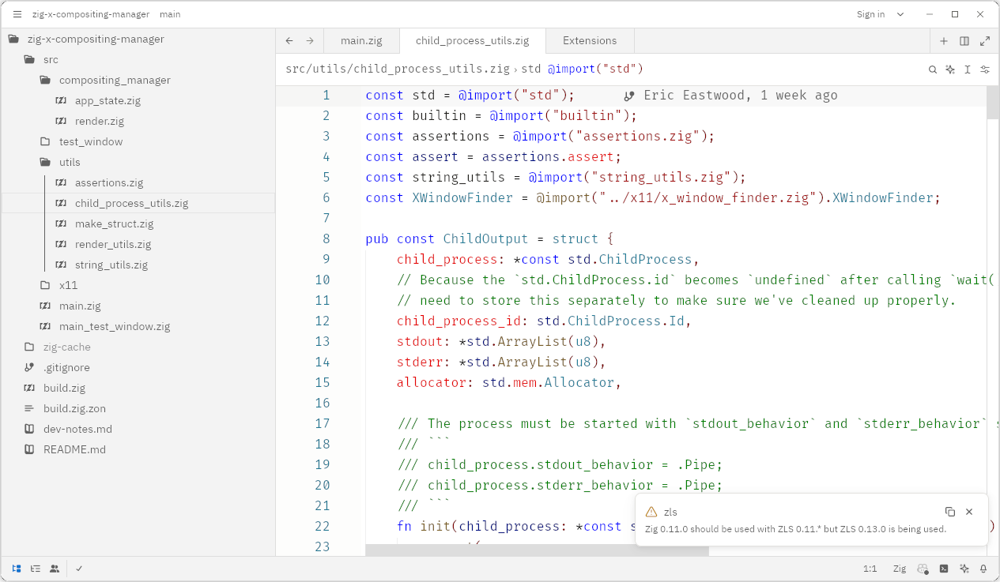

# VSCode Light+ theme for [Zed](https://zed.dev/)

Port of the Light+ (Default Light+) theme from Visual Studio Code to Zed.

Zed | VSCode
--- | ---
 | 
 | 

## Installation

You can install the theme from the official Zed extension repository: open the command
palette (<kbd>Cmd</kbd>+<kbd>Shift</kbd>+<kbd>P</kbd>) and run `zed: extensions`. Search
for `VSCode Light+` and install it. Pick the theme in the theme selector with
<kbd>Cmd</kbd>+<kbd>Shift</kbd>+<kbd>P</kbd> -> `theme selector: toggle` -> `VSCode
Light+`.

## Current Limitations

### Dim and washed out colors

The whole genesis of this theme port was because every light Zed theme was all
dim/dull/muted and washed out (everything is grey-ish) with not enough contrast. This
theme is an improvement but doesn't totally solve the problem because it seems to be a
fundamental issue with how Zed handles rendering and colors (as experienced on Manjaro,
arch-based Linux). See the following issues for more context:

 - https://github.com/zed-industries/zed/issues/9057
 - https://github.com/zed-industries/zed/issues/19100
 - https://github.com/zed-industries/zed/discussions/6485#discussioncomment-4937330
 - https://github.com/zed-industries/zed/issues/17890
 - https://github.com/zed-industries/zed/issues/8293#issuecomment-2299761507
 - https://github.com/zed-industries/zed/issues/15521
 - Even the theme previews on [zed-themes.com](https://zed-themes.com/) are much more
   vibrant because the browser is rendering things as expected.

Zed on Linux (dim) | Zed on macOS (normal)
--- | ---
 | 
 | 

### Syntax Highlighting

Zed's bundled `highlights.scm` files at
https://github.com/zed-industries/zed/tree/main/crates/languages/src often do not
define all the queries for syntax nodes needed to style the theme. This means that some
syntax nodes have different colors when compared to the original theme.

## Development

As you can see if you dive into the theme file, there are plenty of things that are not
filled in as I couldn't see where they were being used in Zed. Feel free to create PR's
to fill in any gaps (include screenshots and context).

Also see the [*developer notes*](./dev-notes.md) for more information.
